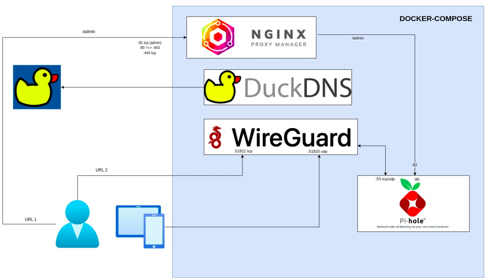
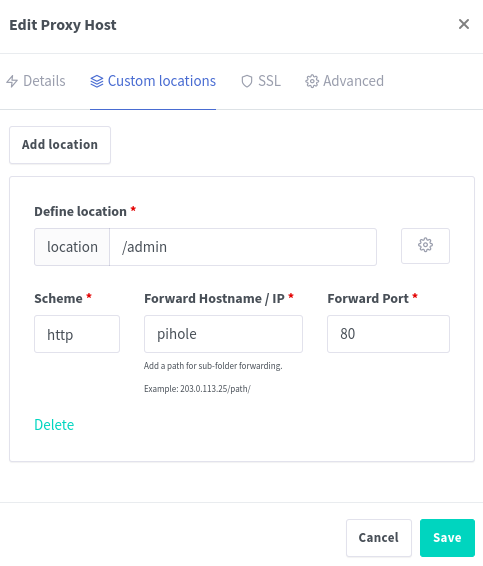

# Configuración de Pihole, Wireguard y DuckDNS con Docker Compose

Este repositorio de GitHub contiene un archivo de variables de entorno y un archivo de Docker Compose para usar Pihole, Wireguard y DuckDNS juntos. Esta configuración permite crear una VPN segura y privada, bloquear anuncios y rastreadores en todos los dispositivos conectados y tener una dirección IP pública en constante actualización mediante DuckDNS.

## Requisitos previos

-   Docker y Docker Compose deben estar instalados en el host.
- Una cuenta de DuckDNS.

## Configuración de variables de entorno

Antes de usar Docker Compose, debes editar el archivo `.env` en la raíz del directorio del proyecto y configurar las siguientes variables de entorno:

```
WG_HOST= # Dirección IP/DNS del servidor de Wireguard
WG_PASSWORD= # Contraseña del servidor de Wireguard 
PH_WEBPASSWORD= # Contraseña para acceder a la interfaz web de Pihole 
DD_SUBDOMAINS= # Subdominios de DuckDNS separados por coma
DD_TOKEN= # Token de DuckDNS

```

## Configuración de DuckDNS

1.  Registra una cuenta en [DuckDNS](https://www.duckdns.org/) si aún no tienes una.
2.  Obtén tu token de DuckDNS siguiendo las instrucciones de la [documentación de DuckDNS](https://www.duckdns.org/spec.jsp?id=duc127&prev=duc614).
3.  Decide en qué subdominios de DuckDNS deseas usar y configura la variable `DD_SUBDOMAINS` en el archivo `.env` con una lista de ellos separados por comas. Por ejemplo: `DD_SUBDOMAINS=subdominio1,subdominio2,subdominio3`.
4.  Configura la variable `DD_TOKEN` en el archivo `.env` con tu token de DuckDNS. Por ejemplo: `DD_TOKEN=abcdefgh-1234-5678-90ab-cdef01234567`.
5.  Ejecuta `docker-compose up -d` para iniciar los servicios de DuckDNS.

Una vez que hayas completado estos pasos, DuckDNS actualizará automáticamente tu dirección IP pública en los subdominios especificados en `DD_SUBDOMAINS`. Puedes acceder a tu subdominio a través de un navegador web para confirmar que está funcionando correctamente.

## Configuración de Docker Compose

El archivo de Docker Compose incluye los siguientes servicios:

-   **wg-easy**: servicio de Wireguard.
-   **pihole**: servicio de Pihole.
-   **nginx-proxy-manager**: servicio de Nginx Proxy Manager.
-   **duckdns**: servicio de DuckDNS.

Puede editar el archivo de Docker Compose según sus necesidades. Por ejemplo, si desea **habilitar el servicio de monitoreo** de Uptime Kuma, puede descomentar las líneas correspondientes.

## Uso de Docker Compose

Después de configurar las variables de entorno, puede ejecutar los servicios utilizando el siguiente comando:

`docker-compose up -d`

Este comando creará y ejecutará todos los contenedores necesarios en segundo plano. Puede detener los contenedores utilizando el siguiente comando:

`docker-compose down`

## Configuración de nginx-proxy-manager

Este repositorio también incluye [nginx-proxy-manager](https://github.com/jc21/nginx-proxy-manager), una herramienta para gestionar fácilmente proxies inversos y certificados SSL.

Para utilizarlo, se debe acceder a la interfaz web de nginx-proxy-manager en `https://<tu-dominio>:81` (reemplaza `<tu-dominio>` con tu dominio real). Es necesario tener el puerto 80, 81 y 443 abiertos en el router para que la conexión pueda ser establecida.

Una vez dentro de la interfaz de usuario, sigue las instrucciones para agregar tus dominios y configurar los proxies inversos y certificados SSL. La documentación oficial de nginx-proxy-manager tiene toda la información necesaria para llevar a cabo estas tareas.

Para más información, consulta la [documentación oficial de nginx-proxy-manager](https://nginxproxymanager.com/guide/).

#### 🛑 Importante

En ningún caso expongas los puertos DNS de pi-hole a internet, estos deben ser accesibles solo desde la maquina de docker o la red local. Configura tu firewall para bloquear estos puertos.
## Diagramas y capturas

Los siguientes diagramas detallan la configuracion realizada, aunque esta no tiene porque ser seguida integramente.

### *Diagrama de flujo*

El funcionamiento general de la PoC propuesta, se resume con el siguiente diagrama.



### *Configuraciones hosts - **Nginx Proxy Manager***

Se han definido dos hosts, uno para el panel de **Nginx Proxy Manager** y **Pihole** y otro para el panel de **WireGuard**. Cabe la posibilidad de configurar el acceso al panel de **Wireguard**, como URI, al igual que el panel de **Pihole**, aunque el uso de redirecciones internas, complica dicha configuración.


### *Configuración URL general (**Nginx Proxy Manager** y **Pihole**)*

Para la configuración de **Nginx Proxy Manager** se define esta configuración general para este dominio.


Uso de certificado forzado con **letsencrypt**.


Configuración del **Location** para acceder a **Pihole**



### *Configuración URL Panel **Wireguard** *

Definición general para este dominio.


Uso de certificado.

